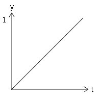
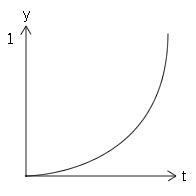
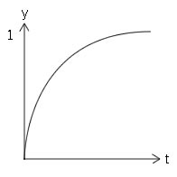
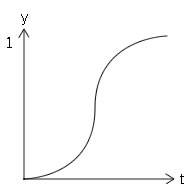
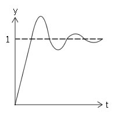
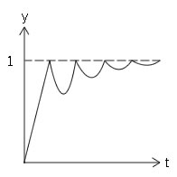

canvas里的变速（线性）运动
========================

在canvas还未成为规范前，对于html元素的动画都是通过定时器不断改变DOM属性来实现的，当到了某个目标值，我们要做的只是判断属性值是否相等然后再决定是否清空定时器。元素的动画包括线性和变速，这样的动画可以自己去写，当然也有很多类似的动画库，比如之前在做的[flappy bird](http://www.yi-jy.com/2014/12/28/%E7%94%A8js%E5%BC%80%E5%8F%91flappy-bird/)时里面提到的tween.js

而canvas里的动画不同于html元素，因为它没有DOM概念，我们在canvas绘制都是图形，打开控制台你也只能看到一个canvas元素，好似一台封装好的电视，你能看到各种不同的画面，但你不知道它里面各个原件是如何工作。因此在某种程度来说也导致了它难以调试，就好像css3动画，我们只能设定属性的初始值，运动模式以及目标值，却不能像审查元素一样看到起属性变化的过程。如果要调试，大部分的操作是alert和console.log。很自然，canvas里的图形动画不是改变left，top值，他是通过不断清空画布的全部或局部，然后又重新绘制canvas画布的全部或局部的。咋一看这样的操作很消耗性能，尤其是画布信息比较多或改变比较大时，但浏览器方面对canvas做了处理，因此一般而言动画都能流畅运行。

再次需要明确的是，因为canvas本身也不支持低版本的浏览器，所以关于canvas里动画我们放弃用setInter和setTimeout，而是用requestAnimationFrame，它只是有一个参数作为回调，返回一个id值，正因如此，我们可以通过将这个id传入到cancelAnimationFrame函数中来取消这个定时器，用法如下，它运行的事件间隔就是屏幕刷新的频率（1000/60，即美妙60帧）。如果要做低版本的兼容，你也可以结合setTimeout封装。

```js

var requestAnimationFrame = window.requestAnimationFrame || window.mozRequestAnimationFrame || window.webkitRequestAnimationFrame,
	cancelAnimationFrame = window.cancelAnimationFrame || window.mozCancelAnimationFrame || window.webkitCancelAnimationFrame;
 
function animate (){
	...
	t = requestAnimationFrame(arguments.callee); // or requestAnimationFrame(animate)
	if(offsetTime == duration){
		cancelAnimationFrame(t);
	}
	...
}

```

这篇文章主要说的是canvas的运行形势，它包含匀速，加速，减速，先加速再减速，弹簧以及反弹与东。我们知道，对于匀速和变速运动，他们有着三个相同点：初始值、目标值以及运动周期，唯一的区别就是他们在同一时间点速度不同。首先来看个demo：[canvas里的变速(线性)运动](http://yi-jy.com/demo/201508/canvas-move-mode/)

[canvas里的变速（线性）运动](http://yi-jy.com/demo/201508/canvas-move-mode/)

那么这些运动形式是如何实现的呢？我们已知初始值，目标值以及运动周期，这样在运动的过程中，我们就可以不断获得运动进度（已percentComplete表示），对于某个事件点而言，图形运动的距离就是（目标值 - 初始值）*percentComplete，所以要产生变速的效果，就要在percentComplete上做文章，就好像我们需要做一个函数，这样的函数可以处理percentComplete，先变化很快，后变化很慢，最后达到1，有或者一直很快，最后达到1.除了匀速运动，函数都需要处理percentCpmplete，假设这个处理函数为moveModeFn有：

```js

function animate() {
	var pffsetTime = endTime - startTime, // startTime 为开始运动的时间
		percentCpmplete = offsetTime/duration;
		percentRun = moveModeFn(percentComplete);
	ball.x = parseInt(percentRun*moveDis) + ball.initX;

	t = requestAnimationFrame(arguments,callee);	
	
	(offsetTime > duration) && cancelAnimationFrame(t);
}

```

记下来看下这几种运动形式里的moveFn：

**匀速**

匀速运动相对来说比较简单，随着时间的增加，完成百分比也是匀速增加的，所以不用对这个完成百分比做任何处理，代码和示意图如下：

```js

function linear (percentComplete) {
	return percentComplete;	
}

```



**加速**

对于加速，可以对百分比做平方处理，0.1的平方是0.01,0.5的平方是0.25，0.9的平方是0.81···由此我们可知随着传入moveModeFn函数的百分比越大，最终得到的百分比就越快接近1，代码和示意图如下：

```js

function easeIn (percentComplete, strength) {
	return Math.pow(PercentComplete. strength*2 || 2);
}

```



**减速**

减速就是加速的变化的反过程，代码和示意图如下：

```js

function easeOut (percentComplete, strength) {
	return 1- Math.pow(1 - percentComplete, strength*2 || 2);
}

```



**线加速再减速**

先加速在减速的变化让我们想到了正弦波形图，代码和示意图如下：

```js

function easeInOut (percentComplete) {
	return percentComplete - Math.sin(percentComplete*2*Math.PI)/(2*Math.PI);
}

```



**弹簧**

弹簧运动是指图形运动会超过目标值，然后又反向运动，经过几次来回目标值那个轴，最终停下来。代码和示意图如下：

```js

function elastic (percentComplete, passes) {
	var passes = passes || 3;
	return ((1-Math.cos(percentComplete * Math.PI * passes)) * (1 - percentComplete)) + percentComplete;
}

```



**反弹**

与弹簧运动不同的是，反弹运动不会越过目标值那个点，而是到达词典后，反向运动，经过几次来回运动最终停止。代码和示意图如下：

```js

function bounce (percentComplete , bounces){
	percentComplete = elastic(percentComplete , bounces);
	eturn percentComplete <= 1 ? percentComplete : 2-percentComplete;
}

```




